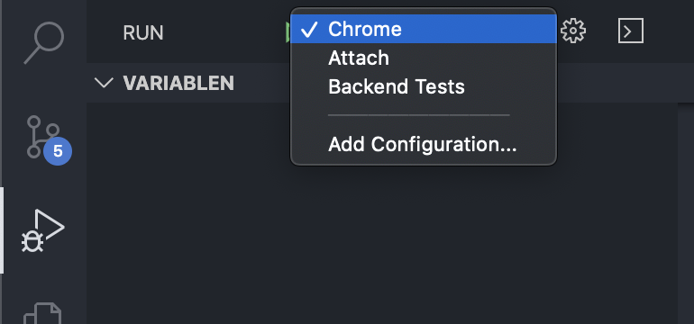

# What's in this repo
Hybrid client for Share My Cart for Web, iOS, Android

## Motivation

> tl;dr: An app for collaborative neighborhood groceries shopping, so we can stay contained and help not spread viruses

Isolation is key to not spreading the virus. Whether it's because we're locked down, because we feel sick or because we simply put ourselves in a home-quarantine: We need to reduce public movement.

Buying groceries is something we all need to do from time to time.
I'll be out probably on Friday. I'll make a shopping list, I'll order it so that I spend as few time as possible in-store, I'll buy only necessary stuff, not more than I need for my family for the week.
It would be easy for me to add another item for my neighbours if I only knew they also need the same stuff - and it would enable them to stay home.

It's really a simple process which is a (small) solution to a universal problem worldwide.

## Current state

This project is in a very early stage. It's 2020, March 18 and Sars-Cov-2 is spreading like crazy in Europe.
Though this project sounds a bit miniscule (and maybe even ridiculous compared to other initiatives like [3D-printing respirator valves for those already fighting death](https://www.fastcompany.com/90477940/these-good-samaritans-with-a-3d-printer-are-saving-lives-by-making-new-respirator-valves-for-free) ), but it's something for the better. And it's something I can do.

A fist website (in German) is online at [sharemycart.com](http://www.sharemycart.com/).

## How to contribute

So you really would like to join? Awesome!
Have a look at the [issues](https://github.com/sharemycart/sharemycart/issues), best start with the [epics](https://github.com/mrsimpson/sharemycart/issues?q=is%3Aopen+is%3Aissue+label%3Aepic).
There is also an [issue board](https://github.com/sharemycart/sharemycart/projects/1) outlining the next todos
Then, you can get in tough with the very new team on [a channel on the open Rocket.Chat server](https://open.rocket.chat/channel/share-my-cart)

## Getting started as a developer

The UI is implemented using [Ionic Framework](https://ionicframework.com/). For the backend [Firebase](https://firebase.google.com/) is used.

### DB and backend

The current implementation, [Firebase's Firestore](https://firebase.google.com/docs/reference/js/firebase.firestore) is being used. Firestore supplies mechanisms for reactivity and grants maximal freedom due to being hosted and scaled by Google.

Firestore also allows for implementing functions in Golang. This is waht we currently call the [`backend`](https://github.com/mrsimpson/sharemycart/tree/master/backend).

### Client side

The client is implemented using the Ionic framework and React.
Since the DB side is schema-less, the client also comprises a larger part which is responsible for data binding and business logic:

Firestore and the backend functions are consumed in the "client side backend", which is responsible for providing data access to the frontend: 

- The [`firebaseService`](https://github.com/sharemycart/sharemycart/master/src/components/Firebase/firebase.js) provides low-level functions wrapping the firestore API. It ensures the schema and could (and will in future) be provided by server-side functions. The firebase service is only intended to be used from the `models`.
- The [models](https://github.com/sharemycart/hybrid-app/tree/master/src/models) are React components which can be used as superclasses of the pages displayed on the UI. They hook into the React component lifecycle in order to set up listeners to the database which in turn fill the `stores`. Also, they provide handlers for business functions, wrapping the firebase services.
- The [`stores`](https://github.com/sharemycart/sharemycart/blob/master/src/stores) provide singleton caches of the data retrieved from the database. They can be injected into every component which needs it.

The UI components are implemented in React using the [Ionic library for react](https://ionicframework.com/docs/components)

### How to best understand the current code base

The current code is [dased upon the awesome React + Firebase + MobX Tutorial ❤️ by @rwieruch ](https://www.robinwieruch.de/react-firebase-mobx-tutorial)

You can start from the tutorial. You like to get into the code quickly? Then ou are probably best off by launching the app from the `ui` folder using `npm start`. Be sure you provided the credentials either as environment variables. For local development, `.env-development` is being used. You need to adapt the `.env.development` to your firebase credentials and add an `.env.development.local` with the API-key (`REACT_APP_BACKEND_API_KEY="AIz...0S8"`).

Then, open VSCode and add a breakpoint in a UI-component, e. g. `App`. Launch the Chrome using the launch target .

*You are not a coder but still want to help*
Even more great! Check the issues, comment on epics, write own ideas, join the chat. Looking forward to reading from you.

